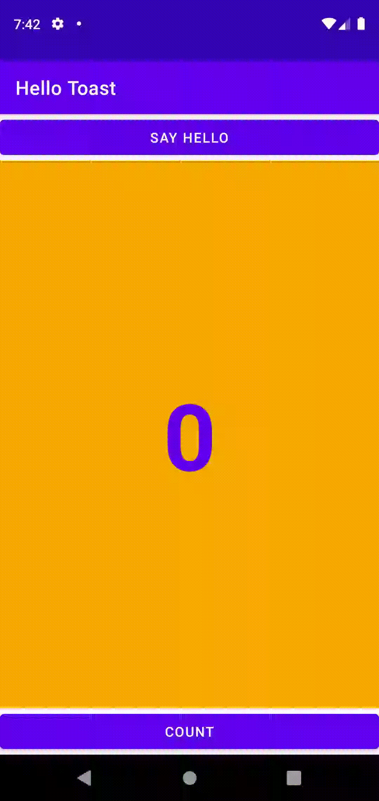

# Week 4 - Task

The task for this week was to create multiple activities and switching between activities using intent.
The task asked for messages to be sent between two different activities by adding additional data to the intents.

## Sending Data through Intent

